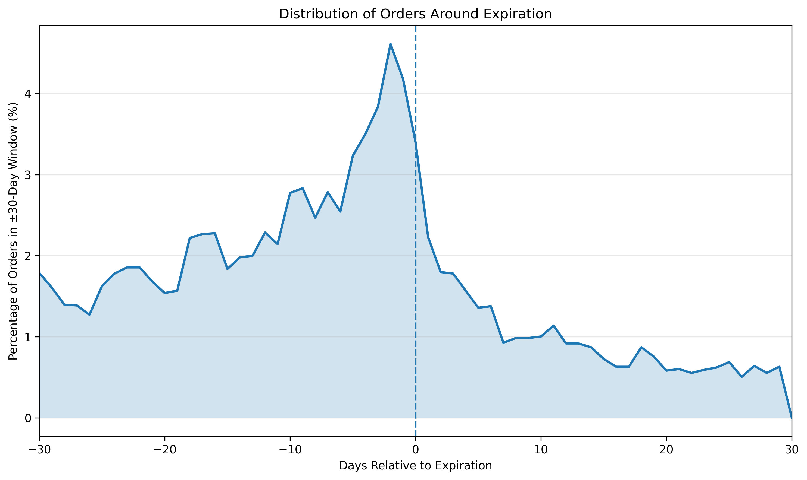
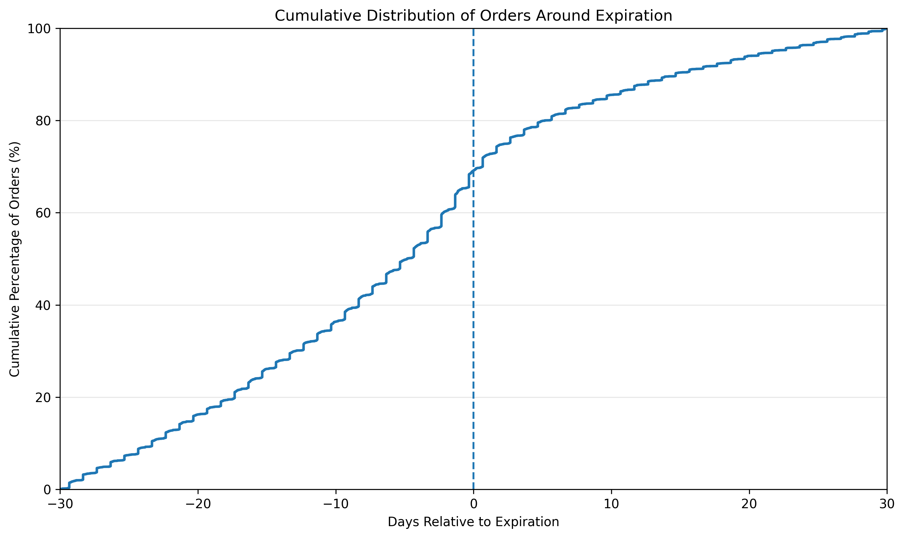

# Expiration Window Analysis

## Overview

This analysis examines customer ordering behavior within 30 days before and after course expiration.

For each expiration event, the nearest order occurring within the ±30-day window was selected. A total of **10,452 expiration events** had a nearby order.

## Before vs. After Expiration

- Orders before expiration: **7,227 (69.14%)**
- Orders on or after expiration: **3,225 (30.86%)**
- Mean order timing: **-4.97 days relative to expiration**
- Median order timing: **-4.83 days relative to expiration**

## Weekly Distribution

| Timing Relative to Expiration   |   Expiration Events | Percent of Nearby Orders   |
|:--------------------------------|--------------------:|:---------------------------|
| 30-22 days before               |                1523 | 14.57%                     |
| 21-15 days before               |                1400 | 13.39%                     |
| 14-8 days before                |                1723 | 16.48%                     |
| 7-1 days before                 |                2581 | 24.69%                     |
| 0-6 days after                  |                1412 | 13.51%                     |
| 7-13 days after                 |                 719 | 6.88%                      |
| 14-20 days after                |                 530 | 5.07%                      |
| 21-30 days after                |                 564 | 5.40%                      |

## Cumulative Distribution Milestones

| Milestone      |   Cumulative Orders | Cumulative Percentage   |
|:---------------|--------------------:|:------------------------|
| 21 days before |                1523 | 14.57%                  |
| 14 days before |                2923 | 27.97%                  |
| 7 days before  |                4646 | 44.45%                  |
| Expiration     |                7227 | 69.14%                  |
| 7 days after   |                8639 | 82.65%                  |
| 14 days after  |                9358 | 89.53%                  |
| 21 days after  |                9888 | 94.60%                  |
| 30 days after  |               10452 | 100.00%                 |

## Key Findings

Order activity within the ±30-day expiration window is strongly concentrated around the expiration date.

The largest weekly concentration of nearby orders occurs during the final seven days before expiration. Overall, more than two-thirds of nearby orders occur before expiration.

The cumulative distribution also shows that most nearby purchasing activity occurs by shortly after expiration. This indicates that the period immediately surrounding expiration represents an especially important part of the customer purchasing lifecycle.

## Figures

### Order Distribution Around Expiration

### Cumulative Distribution of Orders

## Interpretation Note

These percentages describe the distribution of orders among expiration events that had an order within the ±30-day window. They should not be interpreted as the overall probability that an expiration event results in an order.
